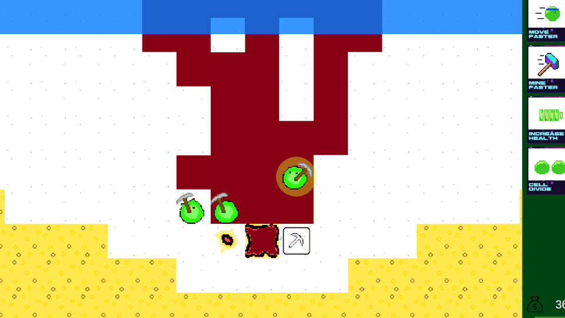
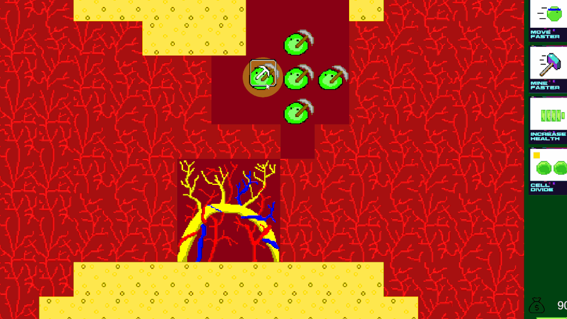

# Root Canal

## Overview

This repo contains all source code and assets for the Global Game Jam 2023 game _Root Canal_.

The Assets/ folder contains subfolders for several third-party assets. All first-party assets are stored in the RootCanal/ subfolder, grouped by "feature" (bacteria, world, etc.). Open the scene files under `scenes/` to see how it's all put together!

The game itself is basically a 2D RTS where the player must direct a group of bacteria to infect a tooth and cause a root canal without being wiped out by mouth wash!
Players acquire "nutrients" by mining through the various tooth tissues and can spend those nutrients on power-ups.

## Play it

_Root Canal_ was meant to be played with a mouse on desktop or the web.
Feel free to demo the [zipped Windows x64 build](./builds/root-canal-win64.zip) from this repo. Just download, unzip, and run the executable!
You can also play [in your browser](https://juliehirt.itch.io/root-canal)!

## Gameplay

